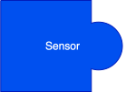
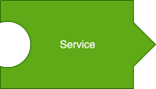
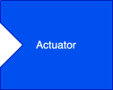
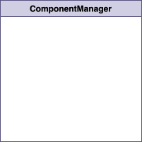
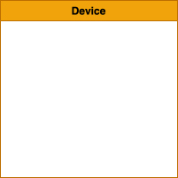
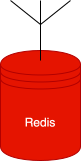
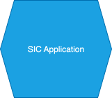

Building Blocks of SIC
=======================================

This section will guide you through the building blocks of the Social Interaction Cloud framework.

Components: Sensors, Actuators, and Services
----------

You can picture creating a SIC application as a process of connecting components together, or building with Legos.
Components are either Sensors, Actuators, or Services.

   **Sensors** are the input devices that collect data from the physical environment.

   **Services** are components that transform data from one format to another in a desirable way.

   **Actuators** are the output devices that operate on the physical environment.

.. figure:: ../_static/component_breakdown.svg
   :alt: Component Breakdown
   :align: center
   :width: 100%

   Breakdown of Component types in SIC.

.. raw:: html

    

Pictured below are some example setups of SIC Components:

.. figure:: ../_static/face_det_comp_diagram.svg
   :alt: Face Detection Component Diagram
   :align: center
   :width: 80%

   Component diagram for a **Dialogflow** application using a Nao robot.

.. figure:: ../_static/multi_actuator_diagram.svg
   :alt: Multi-Actuator Component Diagram
   :align: center
   :width: 80%

   Component diagram for a **Face Detection** application using a Nao robot. It is possible to use the output of a Component as input to multiple other Components.

.. figure:: ../_static/sent_analysis_comp_diagram.svg
   :alt: Sentiment Analysis Component Diagram
   :align: center
   :width: 100%

   Component diagram for a **Sentiment Analysis** application. Note that some Services may require multiple input types.

Supporting Elements: ComponentManager, Connector, and Redis
----------

In reality, SIC is a lot more than just Components. There are other elements that are used to support Components, namely:

   **ComponentManagers** are responsible for starting and stopping Components on hosts/devices.

.. figure:: ../_static/Connector.svg
   :alt: Connector
   :align: center
   :width: 25%

   **Connectors** behave as remote controls and are the actual interface the user uses to interact with the Components.

   **Devices** are the physical devices where the Components run.

   **Redis** is the message broker that is used to communicate between the Components.

   The **SIC Application** is the script the user writes that connects the Components together.

Example Application Diagrams
----------

.. figure:: ../_static/DialogflowAppSimple.svg
   :alt: Redis
   :align: center
   :width: 80%

   High-level diagram for a simple Dialogflow application.
