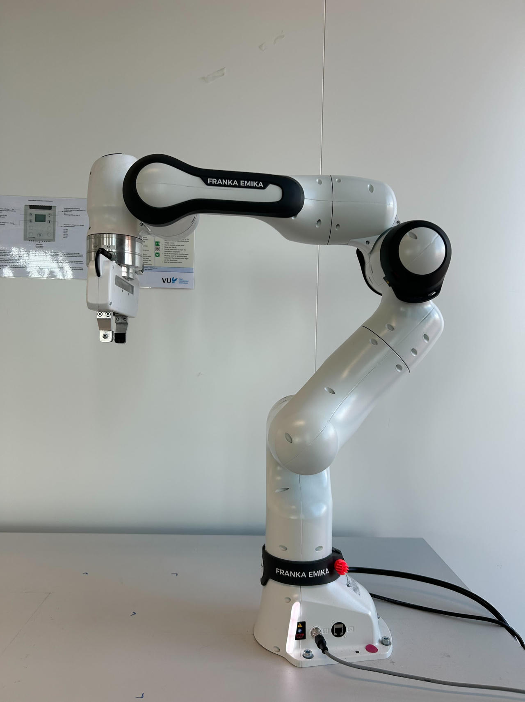

Getting started with the Franka Emika Research 3
======================

This is only a brief introductory guide on how to use the Franka Emika robot. For more detailed information—especially regarding safety—please refer to the product manual available here: Franka Robot Manual.

📄 Installation Guide
----------------------------

1. Follow the :doc:`tutorial <../tutorials/1_installation>` to have the SIC framework up and running (If you are not going to use SIC, you can skip this step) 
2. If you want to control the robot directly on your machine without using ROS, there is a lightweight Python package you can install in your virtual environment (venv or conda): `panda-py <https://github.com/JeanElsner/panda-py?tab=readme-ov-file#install>`_. With this package, you don't even need to install libfranka or a real-time kernel. 
3. Since our robot version is ``5.3.2`` (which is ≥ ``5.2.0``), the libfranka version should be  :math:`\geq 0.10.0 \lt 0.13.3`. That means you should download a stable version ending with ``0.10.0.zip``. For example, ``0.13.3.zip`` won’t work because it is not lower than ``0.13.3``.

We recommend downloading the release we have confirmed works with our robot:
https://github.com/JeanElsner/panda-py/releases/download/v0.7.5/panda_py_0.7.5_libfranka_0.10.0.zip

After downloading, use ``pip`` to install the version of **panda-py** that corresponds to your current Python version. For example, if you are using Python 3.10, install the package built for Python 3.10.

.. code-block:: bash

    pip install panda_python-0.7.5+libfranka.0.10.0-cp310-cp310-manylinux_2_17_x86_64.manylinux2014_x86_64.whl

4. More documentation on how to use panda-py can be found `here <https://jeanelsner.github.io/panda-py/panda_py.html>`_

Start with the robot
----------------------------

**Switch on the Franka**
~~~~~~~~~~~~~~~~~~
Press the power switch on the backside of the Control

**Network setup**
~~~~~~~~~~~~~~~~~~
Set up the connection between the Control and the workstation:

1. The workstation's network settings have already been configured, so you simply need to connect the workstation and the Control box using an Ethernet cable. If you're using a workstation or laptop that doesn't have a fixed wired IP address (172.16.0.1) set up, please refer to the instructions `here <https://frankaemika.github.io/docs/getting_started.html#setting-up-the-network>`_
2. Select network ``Wired connection 1``, where the IPv4 address is set to 172.16.0.1.

**Preparing the robot for FCI usage in Desk**
~~~~~~~~~~~~~~~~~~
1. Open a browser, \*Desk (you will need to log in; ask Lilly for the username and password) can be accessed via https://172.16.0.2, although you will see a certificate warning in your browser
2. Unlock joints: go to the joints section and select the unlock icon

.. image:: ../resources/franka_unlock_joints.png
   :width: 200px
   :height: 75px
   :scale: 100 %
   :alt: Unlock joints of the franka robot arm
   :align: center

3. Activate FCI (Go to the right panel where you see *172.16.0.2 N/A* and click on it. A menu will expand—then click the **Activate FCI** option) Once it's activated, the status indicator should turn green (if it's in Execution mode) from blue.

\*Desk is Franka Emika's web-based, intuitive and graphical programming and user interface

**Operate the robot**
~~~~~~~~~~~~~~~~~~
1. If you're going to run code, make sure the operation mode is set to 'Execution' instead of 'Programming'. The status indicator should be green when in Execution mode. If you want to freely move the arm, switch to 'Programming' mode— the status indicator should then turn white.

2. If you're not going to use SIC, you can run a very simple example to make the robot move:
`example/teaching.py <https://github.com/JeanElsner/panda-py/blob/main/examples/teaching.py>`_. This script lets you teach the robot 3 poses and replay the trajectories. Make sure to pass the robot’s IP address when running the script, i.e.: ``python teaching.py 172.16.0.2``

3. If you are using Python version **below 3.11**, you might encounter a **segmentation fault**. To fix this, you can downgrade your NumPy version by running: 

.. code-block:: bash

    pip install "numpy<2"
    
See a `similar issue <https://github.com/JeanElsner/panda-py/issues/40>`_ for panda-py.

4. To move the robot to its starting (home) position, use the ``move_to_start`` function.
You can find more details `here <https://jeanelsner.github.io/panda-py/panda_py.html#panda_py.Panda.move_to_start>`_.

5. If any drastic or dangerous movements occur, please press the emergency stop button. After you press it, always twist and release the button to reset it and allow it to pop back up.

6. If the robot moves to a weird position and you encounter a “Joint Position Error Detected,” and you're unable to recover it back to the reference position or continue operating the robot, please contact Lilly. Only Safety Operators can recover joint position sensor errors.

**Switch off the Franka**
~~~~~~~~~~~~~~~~~~
1. Before switching off the robot, always move it to its starting (home) position first. You can use the ``move_to_start()`` function, see `Panda.move_to_start <https://jeanelsner.github.io/panda-py/panda_py.html#panda_py.Panda.move_to_start>`_.
See the photo below:

2. Then, go to the right panel, click **172.16.0.2 N/A**, and select the **Shut down** option.
The fail-safe locking system is activated, and Franka will shut down. Please make sure the system is properly shut down. You will see the message **"Finished shutting down"** once the process is complete.

3. Then, use the power switch on the back of the control box to disconnect Franka from the main power supply.

.. warning::

    Be aware: after using the switch to power the system off, please ensure to allow adequate waiting time (i.e. in the order of ~ 1 minute) before using it to power the system on again.
