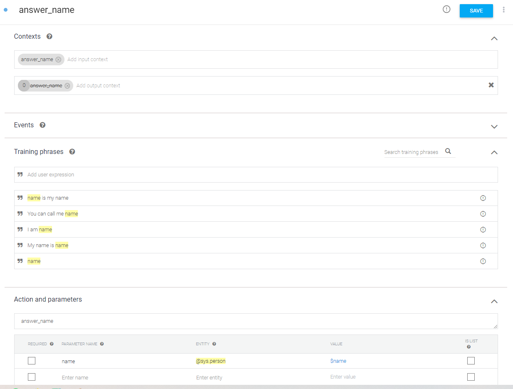

3: Using the Dialogflow Service
=======================================

This tutorial will guide you through the use of the Dialogflow service. First, we introduce Dialogflow and explain how it works. Then, we look at how to use Dialogflow with the Nao robot. Finally, we introduce a way to use Dialogflow to transcribe audio - this is platform-independent and can thus be used even if you don't have access to a robot.

Introduction to Dialogflow
----------------------------
The ``dialogflow`` service enables the use of the `Google Dialogflow <https://dialogflow.com/>`_ platform within your application.

Dialogflow is used to translate human speech into intents (*intent classification*). In other words, not only does it (try to) convert an audio stream into readable text, it also classifies this text into an intent and extracts additional parameters called entities from the text, if specified. For example, an audio stream can be transcribed to the string "I am 15 years old", and classified as the intent 'answer_age' with entity 'age=15'.

In order to create a Dialogflow agent, visit https://dialogflow.cloud.google.com and log-in with a Google account of choice. Use the 'Create Agent' button in the top left to start your first project. For our framework to be able to communicate with this agent, the project ID and a keyfile are required. To get a keyfile read the instructions on :doc:`Getting a google dialogflow key <../services/google_dialogflow_key>`. Once you have a keyfile, place it inside the conf/google folder in your local repository. 

In Dialogflow, the main items of interest are the `Intents <https://cloud.google.com/dialogflow/docs/intents-overview>`_ and the `Entities <https://cloud.google.com/dialogflow/docs/entities-overview>`_. An intent is something you want to recognize from an end-user; here we will show you an example of an intent that is aimed at recognizing someone’s name.

When creating an intent you can name it anything you like; In this example we go with 'answer_name' (seen at the very top). Below 'Action and parameters', you should give the name of the intent that will actually be used in your program. Here, we also set that to 'answer_name'. 

Moreover, it is useful to set a context for the intent. Contexts allow you to define specific states that a conversation must be in for an intent to match. You can also have intents activate contexts to help direct the conversation in future exchanges. Usually though, in a social robotics application, the context is already known. So in this example we match the name of the (input)context with the name of the intent, and thus make it 'answer_name' as well. By default, Dialogflow keeps the context active for 5 exchanges; but we can fix this by changing the 5 (at the start of the output context) to a 0. 

Now we arrive at the most important aspect of the intent: the training phrases. Here, you can give the kinds of input strings you would expect; from these, Dialogflow learns the model it will eventually use. You can identify a part of the phrase as a parameter by double-clicking on the relevant word and selecting the appropriate entity from the list. It will then automatically appear below ‘Action and parameters' as well; the ‘parameter name’ there will be passed in the result (we use ‘name’ here). The system has many built-in entities (like 'sys.person'), but you can define your own entities as well (even through importing CSV files). Our complete intent example thus looks like this (note: using ``sys.given-name`` is usually preferred):

Using the Dialogflow component with your computer's microphone
---------------------------------------------------
We're testing your dialogflow connection by running through the `demo_desktop_microphone_dialogflow.py <https://github.com/Social-AI-VU/sic_applications/blob/main/demos/desktop/demo_desktop_microphone_dialogflow.py>`_ example.

.. note::
    Before running ``demo_desktop_microphone_dialogflow.py``, make sure to start the SIC service by running ``run-dialogflow`` in another terminal. You may have to run ``pip install social-interaction-cloud[dialogflow]`` beforehand.

The code contains detailed comments to explain how everything works. Here, we'll only pick out a few crucial steps.

First, we create a dialogflow object:

.. code-block:: python

    dialogflow_conf = DialogflowConf(keyfile_json=keyfile_json, sample_rate_hertz=44100, language="en")  
    self.dialogflow = Dialogflow(conf=dialogflow_conf, input_source=self.desktop_mic)  

Since we also want something to happen when Dialogflow is triggered, we want to register a callback that will handle that:

.. code-block:: python

    def on_dialog(self, message):  
        if message.response:  
            if message.response.recognition_result.is_final:  
                self.logger.info("Transcript: {transcript}".format(transcript=message.response.recognition_result.transcript))  
    
    self.dialogflow.register_callback(callback=self.on_dialog)  

Now we're ready to get the intent from dialogflow:

.. code-block:: python

    contexts_dict = {"name": 1}  
    reply = self.dialogflow.request(GetIntentRequest(self.session_id, contexts_dict))  
    
    self.logger.info("The detected intent: {intent}".format(intent=reply.intent))  
    
    if reply.fulfillment_message:  
        text = reply.fulfillment_message  
        self.logger.info("Reply: {text}".format(text=text))  

    
And that's it! You should now be able to talk to your computer. See also `the full demo script <https://github.com/Social-AI-VU/sic_applications/blob/main/demos/desktop/demo_desktop_microphone_dialogflow.py>`_ for a more complete example. Make sure to set the proper keyfile path!
Next, we'll cover the basics of robot motion with a Nao robot.
