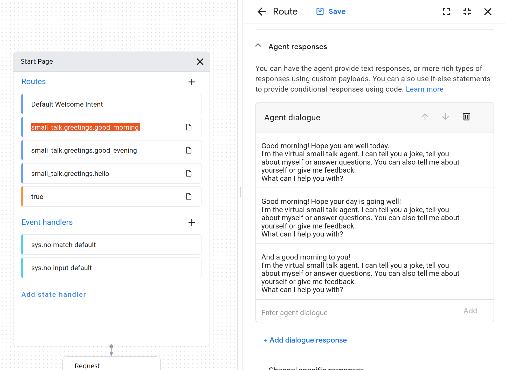

3: Using the Dialogflow Service
=======================================

This tutorial will guide you through the use of the Dialogflow service. First, we introduce Dialogflow and explain how it works. Then, we look at an example of how to use it with your comptuer's microphone.

Introduction to Dialogflow
----------------------------
The ``dialogflow`` service enables the use of the `Google Dialogflow <https://dialogflow.com/>`_ platform within your application.

Dialogflow is used to translate human speech into intents (*intent classification*). In other words, not only does it (try to) convert an audio stream into readable text, it also classifies this text into an intent and extracts additional parameters called entities from the text, if specified. For example, an audio stream can be transcribed to the string "I am 15 years old", and classified as the intent 'answer_age' with entity 'age=15'.

Example: SmallTalk
----------------------------
In order to create a Dialogflow agent, visit https://dialogflow.cloud.google.com and log-in with a Google account of choice. Use the 'Create Agent' button in the top left to start your first project. For our framework to be able to communicate with this agent, the project ID and a keyfile are required. To get a keyfile read the instructions on :doc:`Getting a google dialogflow key <../services/google_dialogflow_key>`. Once you have a keyfile, place it inside the conf/google folder in your local repository. 

Go to the `Google CX page <https://conversational-agents.cloud.google.com/projects>`_ and select the same project that you used to create the keyfile. Click on 'Create agent' and select 'Use prebuilt agent' and then 'SmallTalk'. You can name the agent anything you like. Also change the location to the Netherlands if this is not set by default.

Now that your agent has been created, you have choice between a playbook structure and a flow structure. A playbook structure is based on generative AI while the flow structure allows for more control. For the purposes of this tutorial, we will use a flow-based agent, so click on the 'flow' tab. You will see a basic flow. The blocks are called pages and frame where you are in the conversation and what agents can recognize.

If you click on one of these pages (blocks), it will show you its routes which specify the speech patterns and responses that are available at that stage of the conversation as well as the triggers to enter the page.

.. image:: ../_static/dialogflow_cx_route_with_detail.png
   :width: 500px
   :height: 350px
   :scale: 100 %
   :alt: Routes in Google Dialogflow
   :align: center

The intent determines what we want the agent to recognise and the route determines how we want the agent to respond. To set what the agent will say in response, we consult the fulfillment section:

To test the intent, you can press the three dots next to your user and select 'toggle simulator'. That allows you to have a conversation with your agent without having a robot at your disposal or even connecting SIC.

To train your agent, go into the agent settings, then to 'deterministic flows' and then click on 'train'.

To use your agent in your SIC project, you need both the agent ID and where the agent is located. You can find this information in the URL: everything between 

The location will look something like this: europe-west4, and the agent ID something like this: b7a6bbf1-0246-461f-83bc-11e68d34d67d. Paste this information into the appropriate fields in your SIC project (e.g. in ``demo_nao_dialogflow_cx.py``).

.. code-block:: python

    agent_id = "XXX"  # Replace with your agent ID  
    location = "XXX"  # Replace with your agent location if different  

We can also have the Nao perform gestures as an accompaniment to the dialogflow routes, e.g.

.. code-block:: python

    if reply.intent == "welcome_intent":  
        self.logger.info("Welcome intent detected - performing wave gesture")  
        # Use send_message for non-blocking gesture execution  
        # This allows the TTS to speak while the gesture is performed  
        self.nao.motion.request(NaoPostureRequest("Stand", 0.5), block=False)  
        self.nao.motion.request(NaoqiAnimationRequest("animations/Stand/Gestures/Hey_1"), block=False)  

Before running the demo, install the required dependencies in your SIC project by running the following command in a separate terminal:

.. code-block:: bash

    pip install social-interaction-cloud[dialogflow-cx]

or if you're using z-shell on MacOS:

.. code-block:: bash

    pip install 'social-interaction-cloud[dialogflow-cx]'

Afterwards, run the following command in the terminal to start the dialogflow service:

.. code-block:: bash

    run-dialogflow-cx

Now you can start the demo. 

📹: Video Tutorial
----------------------------

   .. raw:: html

        <iframe width="560" height="315" src="https://www.youtube.com/embed/2cpiXFD8Pj4?si=QrlUV_FeVgewvzjI" title="YouTube video player" frameborder="0" allow="accelerometer; autoplay; clipboard-write; encrypted-media; gyroscope; picture-in-picture; web-share" referrerpolicy="strict-origin-when-cross-origin" allowfullscreen></iframe>
    
And that's it! See also `the full demo script <https://github.com/Social-AI-VU/sic_applications/blob/main/demos/nao/demo_nao_dialogflow_cx.py>`_ for a more complete example. Make sure to set the proper keyfile path, Nao IP, location and agent ID!
Next, we'll cover the basics of robot motion with a Nao robot.
