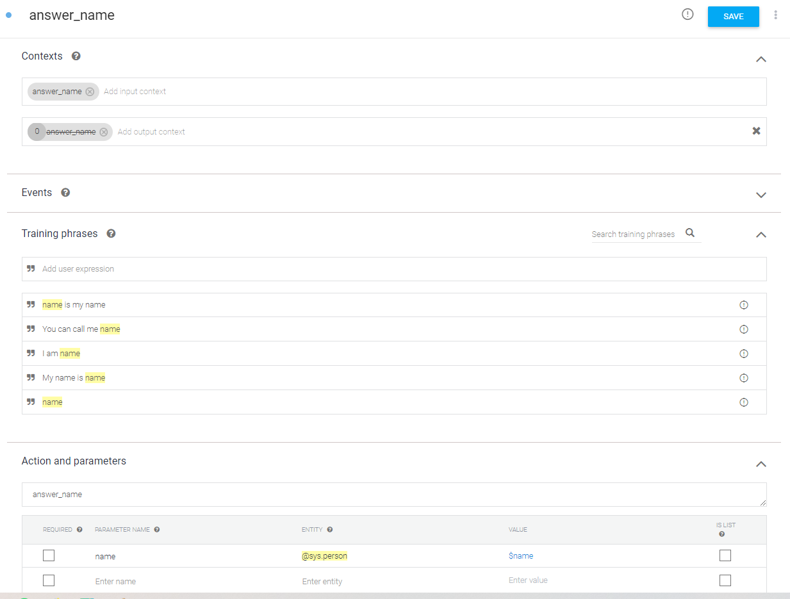

3: Using the Dialogflow Service
=======================================

This tutorial will guide you through the use of the Dialogflow service. First, we introduce Dialogflow and explain how it works. Then, we look at how to use Dialogflow with the Nao robot. Finally, we introduce a way to use Dialogflow to transcribe audio - this is platform-independent and can thus be used even if you don't have access to a robot.

Introduction to Dialogflow
----------------------------
The ``dialogflow`` service enables the use of the `Google Dialogflow <https://dialogflow.com/>`_ platform within your application.

Dialogflow is used to translate human speech into intents (*intent classification*). In other words, not only does it (try to) convert an audio stream into readable text, it also classifies this text into an intent and extracts additional parameters called entities from the text, if specified. For example, an audio stream can be transcribed to the string "I am 15 years old", and classified as the intent 'answer_age' with entity 'age=15'.

In order to create a Dialogflow agent, visit https://dialogflow.cloud.google.com and log-in with a Google account of choice. Use the 'Create Agent' button in the top left to start your first project. For our framework to be able to communicate with this agent, the project ID and a keyfile are required. To get a keyfile read the instructions on :doc:`Getting a google dialogflow key <../services/google_dialogflow_key>`. Once you have a keyfile, place it inside the conf/google folder in your local repository. 

In Dialogflow, the main items of interest are the `Intents <https://cloud.google.com/dialogflow/docs/intents-overview>`_ and the `Entities <https://cloud.google.com/dialogflow/docs/entities-overview>`_. An intent is something you want to recognize from an end-user; here we will show you an example of an intent that is aimed at recognizing someone’s name.

When creating an intent you can name it anything you like; In this example we go with 'answer_name' (seen at the very top). Below 'Action and parameters', you should give the name of the intent that will actually be used in your program. Here, we also set that to 'answer_name'. 

Moreover, it is useful to set a context for the intent. Contexts allow you to define specific states that a conversation must be in for an intent to match. You can also have intents activate contexts to help direct the conversation in future exchanges. Usually though, in a social robotics application, the context is already known. So in this example we match the name of the (input)context with the name of the intent, and thus make it 'answer_name' as well. By default, Dialogflow keeps the context active for 5 exchanges; but we can fix this by changing the 5 (at the start of the output context) to a 0. 

Now we arrive at the most important aspect of the intent: the training phrases. Here, you can give the kinds of input strings you would expect; from these, Dialogflow learns the model it will eventually use. You can identify a part of the phrase as a parameter by double-clicking on the relevant word and selecting the appropriate entity from the list. It will then automatically appear below ‘Action and parameters' as well; the ‘parameter name’ there will be passed in the result (we use ‘name’ here). The system has many built-in entities (like 'sys.person'), but you can define your own entities as well (even through importing CSV files). Our complete intent example thus looks like this (note: using ``sys.given-name`` is usually preferred):

Using the Dialogflow component with Nao microphone
---------------------------------------------------

.. note::
    Before running ``demo_nao_diaglogflow.py``, make sure to start the SIC service by running ``run-dialogflow`` in another terminal. You may have to run ``pip install social-interaction-cloud[dialogflow]`` beforehand.

Let's create a simple demo that prints the transcript and the intent detected by Dialogflow.

Start by importing the necessary SIC functions:

.. code-block:: python

    from sic_framework.devices import Nao  
    from sic_framework.devices.nao import NaoqiTextToSpeechRequest  
    from sic_framework.services.dialogflow.dialogflow import (DialogflowConf, GetIntentRequest, RecognitionResult, QueryResult, Dialogflow)
  
First, we create a connection to the Nao robot to be able to access its microphone. In order to use this intent we created earlier in an application, we need to set the keyfile and the sample rate. To do this, we create the Dialogflow configuration object. Make sure you read the documentation at the start of this page to obtain the key file for your Dialogflow project.

.. code-block:: python

    # connect to the robot  
    nao = Nao(ip='192.168.178.45')  

    # load the key json file
    keyfile_json = json.load(open("../../conf/google/dialogflow-tutorial.json"))  

    # set up the config  
    conf = DialogflowConf(keyfile_json=keyfile_json, sample_rate_hertz=16000)  

Having done this setup, we can initiate the Dialogflow object and connect the output of ``NaoqiMicrophone`` as the input of Dialogflow. The parameters ``ip='localhost`` and ``conf=conf`` pass the ip address of the device the ``DialogflowComponent`` is running on and our configuration to be able to authenticate to Dialogflow.

.. code-block:: python

    # initiate Dialogflow object  
    dialogflow = Dialogflow(ip='localhost', conf=conf)  

    # connect the output of NaoqiMicrophone as the input of DialogflowComponent  
    dialogflow.connect(nao.mic)  

Finally, we need to register a callback function to act whenever Dialogflow output is available. Whenever Dialogflow detects a new word, we will receive a ``RecognitionResult`` message. Then, ``on_dialog`` function simply prints the detected speech when it’s considered ``final``.

.. code-block:: python

    # register a callback function to act upon arrival of recognition_result  
    dialogflow.register_callback(on_dialog)  

Now we can start actually getting intents from the user! We need to set a chat ID, with which Dialogflow identifies the conversation. This can be a random number (or the same one if you want to continue a conversation). Then, we request Dialogflow to get an intent. It will start sending the Nao’s microphone audio to Dialogflow. As you start talking, the SIC ``on_dialog`` function should print the transcript in the terminal.

.. code-block:: python

    x = np.random.randint(10000)  

    for i in range(25):  
        print(" ----- Conversation turn", i)  
        reply = dialogflow.request(GetIntentRequest(x))  

        print(reply.intent)  

        if reply.fulfillment_message:  
            text = reply.fulfillment_message  
            print("Reply:", text)  
            nao.tts.request(NaoqiTextToSpeechRequest(text))  

Here is the definition for ``on_dialog``:

.. code-block:: python

    def on_dialog(message):  
        if message.response:  
            if message.response.recognition_result.is_final:  
                print("Transcript:", message.response.recognition_result.transcript)  

And that's it! You should now be able to talk to your robot. See also `this demo script <https://github.com/Social-AI-VU/sic_applications/blob/main/demos/nao/demo_nao_dialogflow.py>`_ for a more complete example. Make sure to set the proper keyfile path!

Transcribing audio with Dialogflow
-----------------------------------

This section shows you how to transcribe the audio from a file on your computer using Dialogflow. Dialogflow was made to be used for conversations, but as it sends a transcription of what was said we can use it to transcribe audio as well.

.. note::

    This is not necessarily the best way to transcribe audio.  
    This demo is here for two reasons:  

        1. To provide a platform independent way to test your Dialogflow setup  

        2. To demonstrate how to work with audio and more complex Dialogflow setups in the framework  

In addition to the setup described in :doc:`1_installation`, you will also need to have `PyAudio <https://pypi.org/project/PyAudio/>`_ installed on your virtual environment.

**Approach**
~~~~~~~~~~~~~~~~~~

This tutorial will show you how to convert audio to text. We'll split this up into a couple parts

    1. Converting an audio file to a .wav file

    2. Starting the Dialogflow component

    3. Transcribing the audio file

**Converting to .wav format**
~~~~~~~~~~~~~~~~~~~~~~~~~~~~~~

To be able to read the audio in python, its easiest to convert it to a ``.wav`` file. Depending on which file type you have this might need to be done differently, but here is an example using ffmpeg. Make sure to convert it to mono 16bit PCM little-endian audio (this is what ``pcm_s16le`` means).

.. code-block:: bash

    ffmpeg -i my_audio.mp3 -codec:a pcm_s16le -ac 1 -ar 44100 my_audio.wav

**Installing and starting Dialogflow**
~~~~~~~~~~~~~~~~~~~~~~~~~~~~~~~~~~~~~~~

First, start the SIC Dialogflow service, you should see something like this:

.. code-block:: bash

    [SICComponentManager 192.168.0.181]: INFO: Manager on device 192.168.0.181 starting  
    [SICComponentManager 192.168.0.181]: INFO: Starting component manager on ip "192.168.0.181" with components:  
    [SICComponentManager 192.168.0.181]: INFO:  - DialogflowService  

**Getting a key**
If you don't already have a key, check out :doc:`Getting a google dialogflow key <../services/google_dialogflow_key>`. If everything went right, you should have a ``your_dialogflow_key.json``.

**Transcribing the audio**
~~~~~~~~~~~~~~~~~~~~~~~~~~

Alright! Now that we have everything set up we can start transcribing the audio.

Just to be sure, make sure you have:

    The dialogflow component is running

    You have a dialogflow key

    A ``.wav`` audio file in the folder you are working in

In a new python file copy the following code:

.. code-block:: python

    import threading  
    import pyaudio  
    import wave  
    import json  

    from sic_framework.core.message_python2 import AudioMessage  
    from sic_framework.services.dialogflow.dialogflow import DialogflowConf, GetIntentRequest, Dialogflow, \  
        StopListeningMessage, QueryResult, RecognitionResult  

To read the wave file we can use the python wave library. This will read the file as raw bytes, which is what dialogflow will expect from us.

.. code-block:: python

    # Read the wav file  
    wavefile = wave.open('office_top_short.wav', 'rb')  
    samplerate = wavefile.getframerate()  

    print("Audio file specs:")  
    print("  sample rate:", wavefile.getframerate())  
    print("  length:", wavefile.getnframes())  
    print("  data size in bytes:", wavefile.getsampwidth())  
    print("  number of chanels:", wavefile.getnchannels())  
    print()  

Now we get to more interesting stuff. The Dialogflow component will send back a lot of information, so we will have to handle that, and extract the transcription.

First, we'll create an event. We'll set this event whenever Dialogflow has detected the end of a sentence. That way we can ask Dialogflow to listen to the next immediately after. Its easiest to use a ``threading.Event``, because Dialogflow will signal the end of a sentence at an arbitrary point.

The ``on_dialog`` function handles setting this event. It also will print the partial transcript intermittently and once dialogflow has chosen a final transcript we'll add this to the list.

.. code-block:: python

    # set up the callback and variables to contain the transcript results  
    # Dialogflow is not made for transcribing, so we'll have to work around this by "faking" a conversation  

    dialogflow_detected_sentence = threading.Event()  
    transcripts = []  

    def on_dialog(message):  
        if message.response:  
            t = message.response.recognition_result.transcript  
            print("\r Transcript:", t, end="")  

            if message.response.recognition_result.is_final:  
                transcripts.append(t)  
                dialogflow_detected_sentence.set()  

Now we can set up dialogflow. We do this by first reading in our json key:

.. code-block:: python

    # read you keyfile and connect to dialogflow  
    keyfile_json = json.load(open("path/to/your_keyfile_here.json"))  

And then we can create a configuration for the dialogflow component. Make sure to set the proper sample rate!

.. code-block:: python

    conf = DialogflowConf(keyfile_json=keyfile_json, sample_rate_hertz=samplerate, )  
    dialogflow = Dialogflow(conf=conf)  

We'll direct the output message's produced by dialogflow to the ``on_dialog`` function by registering it as a callback.

.. code-block:: python

    dialogflow.register_callback(on_dialog)

To get a sense of what dialogflow is hearing, we'll also play the sound on our own speakers.

.. code-block:: python

    # Set up output device to play audio along transcript  
    p = pyaudio.PyAudio()  
    output = p.open(format=pyaudio.paInt16,  
                    channels=1,  
                    rate=samplerate,  
                    output=True)  

With everything set up, we can start to ask dialogflow to detect a sentence! We do this using ``dialogflow.request(GetIntentRequest(), block=False)``. Non-blocking is important here, because we need to keep sending audio (and not wait for some result, which will not occur because no audio is sent). Every time dialogflow detects a sentence, we ask it to listen for the next one!

.. code-block:: python

    # To make dialogflow listen to the audio, we need to ask it to "listen for intent".  
    # This means it will try to determine what the intention is of what is being said by the person speaking.  
    # Instead of using this intent, we simply store the transcript and ask it to listen for intent again.  

    print("Listening for first sentence")  
    dialogflow.request(GetIntentRequest(), block=False)  

    # send the audio in chunks of one second  
    for i in range(wavefile.getnframes() // wavefile.getframerate()):  

        if dialogflow_detected_sentence.is_set():  
            print()  
            dialogflow.request(GetIntentRequest(), block=False)  

            dialogflow_detected_sentence.clear()  

        # grab one second of audio data  
        chunk = wavefile.readframes(samplerate)  

        output.write(chunk)  # replace with time.sleep to not send audio too fast if not playing audio  

        message = AudioMessage(sample_rate=samplerate, waveform=chunk)  
        dialogflow.send_message(message)  

When we're done we'll write the output to a file and clean up dialogflow.

.. code-block:: python

    dialogflow.send_message(StopListeningMessage())  

    print("\n\n")  
    print("Final transcript")  
    print(transcripts)  

    with open('transcript.txt', 'w') as f:  
        for line in transcripts:  
            f.write(f"{line}\n")  

    output.close()  
    p.terminate()  

Thats the code! Run your file like so:

.. code-block:: bash

    cd sic_framework/tests
    python3 demo_transcribe_with_dialogflow.py

The output should look something like this:

.. code-block:: bash

    Audio file specs:  
        sample rate: 44100  
        length: 4505992  
        data size in bytes: 2  
        number of chanels: 1  

    Component not already alive, requesting DialogflowService from manager  192.168.0.181  
    [DialogflowService 192.168.0.181]: INFO: Started component DialogflowService  
    Listening for first sentence  
    Transcript: I can't believe I started the fire  
    Transcript:  a brown  
    Transcript: I'm taking two so I can parcel them up and eat them at my leisure later on much healthier  

    Final transcript
    ["I can't believe I started the fire", ' a brown']  

And the transcript should be stored in ``transcript.txt``!

When the transcript is done, you might get some errors about google not receiving new request, like ``google.api_core.exceptions.InvalidArgument: 400 Did not receive any new request for 1m.`` We are still working on how to properly end a conversation after it is done, but Google's documentation has little mention of this. If you find it, let us know!
