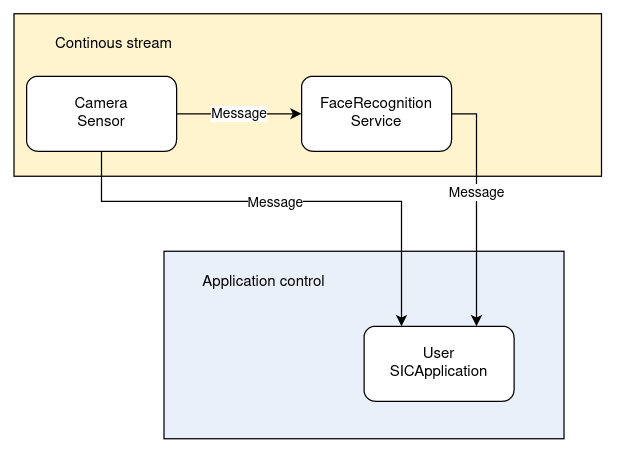

5: Visual Perception
=======================================

This tutorial shows you how to use a visual perception service to detect objects in the camera feed.

📄 Face Detection Tutorial
----------------------------

**Prerequisites**
~~~~~~~~~~~~~~~~~~~~~~~~~~~~
    - redis server is running
    - face detection service is running

Code (in separate terminals):

.. code-block:: bash

    redis-server conf/redis/redis.conf  
    run-face-detection  

**Face Detection**
~~~~~~~~~~~~~~~~~~~~~~~~~~~~
Import necessary libraries:

.. code-block:: python

    import queue  

    import cv2  
    from sic_framework.core import utils_cv2  
    from sic_framework.core.message_python2 import (  
        BoundingBoxesMessage,  
        CompressedImageMessage,  
    )  
    from sic_framework.devices.common_desktop.desktop_camera import DesktopCameraConf  
    from sic_framework.devices.desktop import Desktop  
    from sic_framework.services.face_detection.face_detection import FaceDetection  

Create buffers for image/face objects, define callback functions. Whenever a new image or face detection is received, ``on_image`` or ``on_faces`` will be called to place the data object into its respective buffer.

.. code-block:: python

    imgs_buffer = queue.Queue(maxsize=1)  
    faces_buffer = queue.Queue(maxsize=1)  

    def on_image(image_message: CompressedImageMessage):  
        imgs_buffer.put(image_message.image)  

    def on_faces(message: BoundingBoxesMessage):  
        faces_buffer.put(message.bboxes)  

Set up the camera, register callback functions:

.. code-block::python

    # Create camera configuration using fx and fy to resize the image along x- and y-axis, and possibly flip image  
    conf = DesktopCameraConf(fx=1.0, fy=1.0, flip=1)  

    # Connect to the services  
    desktop = Desktop(camera_conf=conf)  
    face_rec = FaceDetection()  

    # Feed the camera images into the face recognition component  
    face_rec.connect(desktop.camera)  

    # Send the outputs back to this program  
    desktop.camera.register_callback(on_image)  
    face_rec.register_callback(on_faces)  

Display face detection:

.. code-block::python

    while True:  
        img = imgs_buffer.get()  
        faces = faces_buffer.get()  

        for face in faces:  
            utils_cv2.draw_bbox_on_image(face, img)  

        cv2.imshow("", img)  
        cv2.waitKey(1)  

The full code can be found `here <https://github.com/Social-AI-VU/sic_applications/blob/main/demos/desktop/demo_desktop_camera_facedetection.py>`_.

📄 Facial Recognition Tutorial
----------------------------

**Prerequisites**
~~~~~~~~~~~~~~~~~~~~~~~~~~~~

    - redis server is running
    .. code-block:: bash

            redis-server conf/redis/redis.conf  
    - Make sure the dependencies for the face recognition service are installed in your virtual environment
    .. code-block:: bash

        pip install social-interaction-cloud[face-recognition]  

    - Use the following command to start the face recognition service, and pass the model files (the cascade classifier file used in this example can be found here: `haarcascade_frontalface_default.xml <https://github.com/kipr/opencv/blob/master/data/haarcascades/haarcascade_frontalface_default.xml>`_, and the resnet50 model file can be found here `resnet50_ft_weight.pt <https://bitbucket.org/socialroboticshub/framework/src/master/sic_framework/services/face_recognition_dnn/resnet50_ft_weight.pt>`_):
    .. code-block:: bash

        run-face-recognition --model resnet50_ft_weight.pt --cascadefile haarcascade_frontalface_default.xml  

**Facial recognition**
~~~~~~~~~~~~~~~~~~~~~~~~~~~~
Create a new file with the code below or use `demo_desktop_camera_facerecognition.py <https://github.com/Social-AI-VU/sic_applications/blob/main/demos/desktop/demo_desktop_camera_facerecognition.py>`_ from GitHub.

Imports and callbacks:

.. code-block:: python

    import queue  

    import cv2  

    from sic_framework.core.message_python2 import BoundingBoxesMessage  
    from sic_framework.core.message_python2 import CompressedImageMessage  
    from sic_framework.core.utils_cv2 import draw_on_image  
    from sic_framework.devices.desktop.desktop_camera import DesktopCamera  
    from sic_framework.services.face_recognition_dnn.face_recognition_service import DNNFaceRecognition  

    imgs_buffer = queue.Queue()  
    def on_image(image_message: CompressedImageMessage):  
        try:  
            imgs_buffer.get_nowait()  # remove previous message if its still there  
        except queue.Empty:  
            pass  
        imgs_buffer.put(image_message.image)  

    faces_buffer = queue.Queue()  
    def on_faces(message: BoundingBoxesMessage):  
        try:  
            faces_buffer.get_nowait()  # remove previous message if its still there  
        except queue.Empty:  
            pass  
        faces_buffer.put(message.bboxes)  

The actual code:

.. code-block:: python

    # Connect to the services  
    camera = DesktopCamera()  
    face_rec = DNNFaceRecognition()  

    # Feed the camera images into the face recognition component  
    face_rec.connect(camera)  

    # Send back the outputs to this program  
    camera.register_callback(on_image)  
    face_rec.register_callback(on_faces)  

    while True:  
        img = imgs_buffer.get()  
        faces = faces_buffer.get()  

        for face in faces:  
            draw_on_image(face, img)  

        cv2.imshow('', img)  
        cv2.waitKey(1)  

Here is the schematic overview of how this program works. The camera streams its output to the face recognition service, and both stream the output to the program on your laptop.

📹: Video Tutorial (Windows)
----------------------------

.. raw:: html

    <iframe width="560" height="315" src="https://www.youtube.com/embed/VXYRnFJcAEc" title="YouTube video player" frameborder="0" allow="accelerometer; autoplay; clipboard-write; encrypted-media; gyroscope; picture-in-picture; web-share" referrerpolicy="strict-origin-when-cross-origin" allowfullscreen></iframe>