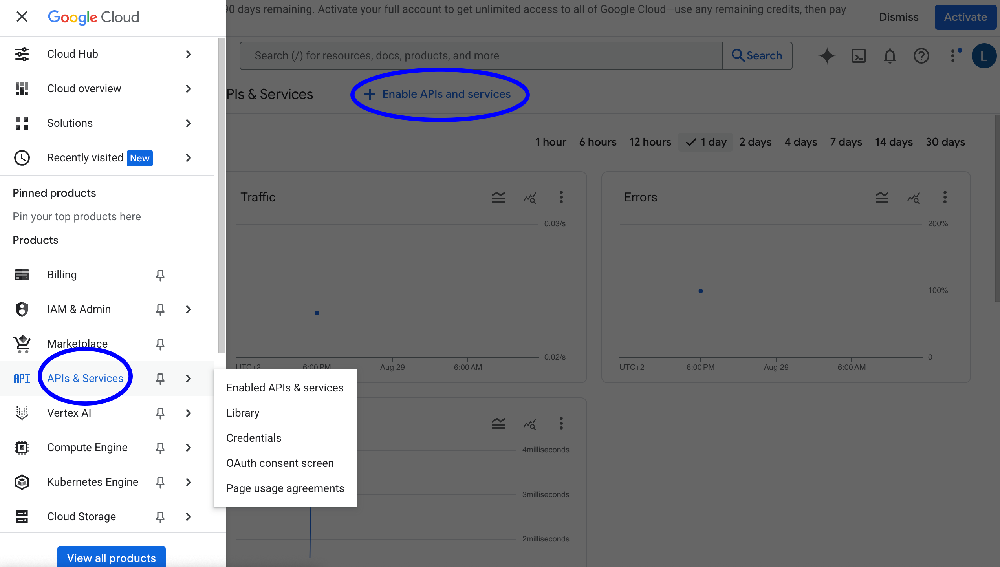

6: Google Cloud Platform
======================

📄 Google Cloud Platform Guide
----------------------------

The Google Cloud Platform is a suite of cloud computing services provided by Google. It provides AI services such as speech-to-text, text-to-speech, and conversational agents.

Some AI services provided by Google Cloud Platform are used in the Social Interaction Cloud framework, with the potential for more services to be used as well.

This tutorial will guide you through the process of setting up a Google Cloud Platform project and using it to run Social Interaction Cloud applications.

To use Google Cloud Platform services, you'll need to:

1. Create a Google Cloud Project
2. Enable desired APIs
3. Set up a service account and credentials to use the APIs
4. Configure your application to use the service account credentials

Let's go through each step:

**Setting up a Google Cloud Project**
~~~~~~~~~~~~~~~~~~~~~~~~~~~~~~~~~~
First, go to the `Google Cloud Platform Console <https://console.cloud.google.com/>`_ and create a new project (Top left).

You can name the project whatever you want, but we will use "SAIL" for this tutorial.

**Enabling APIs**
~~~~~~~~~~~~~~~~~~
Next you need to enable the API for the services you want to use. For the SIC demos, we will use the following services:

- Dialogflow API
- Cloud Speech-to-Text API
- Cloud Text-to-Speech API

To enable the API, go to the "APIs & Services" menu (Top left) and click "Enable APIs and Services".

You can search for the services you want to enable by typing the name of the service in the search bar.

You may need to add a billing account to your project to use the services. However, Google often provides free credits to new users to use the services, and the cost of simple API calls is usually negligible.

**Setting up a service account**
~~~~~~~~~~~~~~~~~~~~~~~~~~~~~~~~
Once you have enabled the APIs, you can create a service account to use the services.

To create a service account, go to the "IAM & Admin" menu (Top left) and click "Service Accounts".

Click "Create Service Account" and give it a name. You can name it whatever you want, but we will use "SAIL" for this tutorial.

You will need to add permissions to the service account to be able to use the APIs. For example, to use Dialogflow and Speech-to-Text, you will need to add the following permissions:

- Dialogflow API Admin
- Cloud Speech Administrator

Next, you will need to create a key for the service account.

.. image:: ../_static/google_cloud_tut/step_four.png
   :alt: Creating a key for a service account
   :align: center
   :width: 600px

Click "Create Key" and select "JSON" as the key type. Download the keyfile and save it to your computer.

**Configuring your application**
~~~~~~~~~~~~~~~~~~~~~~~~~~~~~~~

Place the service account keyfile in the `conf/google` folder of the sic_applications repository.

You can name the keyfile whatever you want, but we will use "google-key.json" for this tutorial.

To use the services in your applications, you need to pass in the keyfile in the configuration of the service you want to use.

Here's an example with the Speech-to-Text service:

.. code-block:: python

    # initialize the speech-to-text service
    stt_conf = GoogleSpeechToTextConf(
        keyfile_json=json.load(open(abspath(join("..", "..", "conf", "google", "google-key.json")))),
        sample_rate_hertz=44100,
        language="en-US",
    )

    stt = GoogleSpeechToText(conf=stt_conf, input_source=desktop_mic)

**Additional Steps**
~~~~~~~~~~~~~~~~~~~~

Some services such as Dialogflow require additional steps to be taken to use them.

For example, Dialogflow requires you to create a "Agent" and "Intents" to be able to use it.

You can find more information on how to use Dialogflow `here <https://cloud.google.com/dialogflow/es/docs/quick/build-agent>`_.