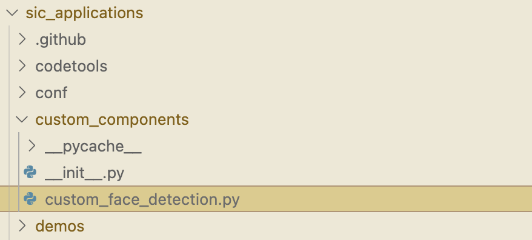

7: Creating Components
=======================================

This tutorial shows you how to create your own components.

Creating Components
----------------------------
To create custom functionality, such as new sensors, functions on the robot, or a new type of data processing such as a custom object detection system, you will need to create your own component. This component can then be used in your SIC programs.

Creating a component requires the following steps:

    1. Choosing a component type for your application (See flowchart below)
    2. Choosing the input datatypes (See SIC standardized pre-defined messages todonew)
    3. Creating a new file following the templates (See framework: `sic_framework/services/templates <https://bitbucket.org/socialroboticshub/framework/src/master/sic_framework/services/templates/>`_)
    4. Implement the appropriate methods
    5. Start the component (``python your_file.py``)

At its core, any new component (extending ``SICComponent``) has to implement ``on_message`` and/or ``on_request``. ``on_message`` allows components to be linked to one another, to send and receive messages in a data stream. ``on_request`` allows a component to handle requests and send an explicit reply to the device that requested it.

.. code-block:: python

    class MyComponent(SICComponent):  
    
    ... [other methods, see sic_framework/services/templates/]  

    def on_request(self, request):  
        # Do something  
        
        reply = # Return a SICMessage response  
        return reply  

    def on_message(self, message):  
        # Do something  
        
        # Optional:  
        output = # A SICMessage output of this service  
        self.output_message(output)  

Three helpful subclasses have been defined for common cases in robotics. For these components you only need to implement the ``execute()`` method.

    - Sensor - A sensor is a component that has no inputs, but simply outputs the physical sensor values as often as it can. This forms the starting point of a data stream.

    - Service - A service is a component that is built to combine multiple streams at once, and process them in a synchronized way. For example, a service that has both bounding boxes of detected faces and and an image containing these faces, needs to align the right bounding box message to the right image. A Service will provide these aligned inputs to the execute method.

    - Actuator - An actuator is mostly used for performing physical actions with a robot. For example, requesting the robot to raise its arm. It might be usefull to know when this action is completed, and an Actuator sends back a message whenever it has completed a request.

Use this flowchart to help you determine which type of component class your component should extend:

.. image:: ../_static/component_breakdown.png
   :width: 500px
   :height: 350px
   :scale: 100 %
   :alt: Component breakdown
   :align: center

Make sure to use predifined messages where possible to ensure interoperability between your component and others. See `SIC standardized pre-defined messages todonew` for an overview.

📹: Video Tutorial (Windows)
----------------------------

.. raw:: html

    <iframe width="560" height="315" src="https://www.youtube.com/embed/C_y42blplhs" title="YouTube video player" frameborder="0" allow="accelerometer; autoplay; clipboard-write; encrypted-media; gyroscope; picture-in-picture; web-share" referrerpolicy="strict-origin-when-cross-origin" allowfullscreen></iframe>

Extending an Existing Service
-----------------------------
**Overview**
~~~~~~~~~~~~~~~~~~~~~~~~~~~~
Say there's an existing service that does almost everything you want it to, but there's some slight changes you wish you could make. Luckily, SIC's object-oriented architecture enables you to inherit from and extend the component you wish to modify. Let's take the 'detect' function of the `FaceDetectionComponent <https://github.com/Social-AI-VU/social-interaction-cloud/blob/main/sic_framework/services/face_detection/face_detection.py>`_, for example:

.. code-block:: python

    def detect(self, image):  
        img = array(image).astype(np.uint8)  

        gray = cv2.cvtColor(img, cv2.COLOR_RGB2GRAY)  

        faces = self.faceCascade.detectMultiScale(  
            gray,  
            scaleFactor=1.2,  
            minNeighbors=5,  
            minSize=(int(self.params.minW), int(self.params.minH)),  
        )  

        faces = [BoundingBox(x, y, w, h) for (x, y, w, h) in faces]  

        return BoundingBoxesMessage(faces)  

In this function the ‘scaleFactor’ and ‘minNeighbors’ variables are hidden within the function, meaning the only way to access or change them is to rewrite the function. However, rather than rewriting the whole entire FaceDetectionComponent, we can simply create a new component where we inherit from the FaceDetectionComponent, and change just the detect function.

**Outline**
~~~~~~~~~~~~~~~~~~~~~~~~~~~~
To extend an existing component we will go through the following steps:

1. Identify the component we wish to change.

2. Create a new script called 'custom\_{COMPONENT_NAME}.py'.

.. note::

    It is recommended to add these to a 'custom_components' folder within your repo to keep track of these.

3. Import the original component and relevant modules in the new custom component.

4. Extend the original component, rewrite the functions you wish to change.

5. Change the SICConnector and SICComponentManager to match the new component name.

6. Import the new connector for the custom component in your scripts that use it.

7. Run the new custom component in place of the old one.

**Setup (steps 1 and 2)**
~~~~~~~~~~~~~~~~~~~~~~~~~~~~
First, we have already decided we are going to change the 'detect' function of the FaceDetectionComponent. So next, we create a 'custom_components' folder in our repo if we do not have one already, and within that add a 'custom\_{COMPONENT}' script:

.. note::

    There also needs to be an '\_\_init\_\_.py' script within the custom_components folder. This script should be empty, but it needs to be there for Python to recognize this folder as a module.

Now run 'pip install -e .' within your SIC repository. This will create a link in your environment to the custom_components folder so that you can easily import your custom components within your other scripts.

**Writing a new component (steps 3, 4 and 5)**
~~~~~~~~~~~~~~~~~~~~~~~~~~~~~~~~~~~~~~~~~~~~~~~
Inside the new custom component script, we import the old component, as well as the SICComponentManager, SICConnector, and anything the new custom component may need:

.. code-block:: python

    from sic_framework.services.face_detection.face_detection import FaceDetectionComponent  # Import the original component  
    from sic_framework.core.component_manager_python2 import SICComponentManager  
    from sic_framework.core.connector import SICConnector  

    # additional modules used by custom function  
    import cv2  
    import numpy as np  
    from numpy import array  
    from sic_framework.core.message_python2 import (  
        BoundingBox,  
        BoundingBoxesMessage,  
    )  

We then extend the original component by instantiating a new class and rewriting just the functionality we wish to change:

.. code-block:: python

    class CustomFaceDetectionComponent(FaceDetectionComponent):
        def __init__(self, *args, **kwargs):  
            super(CustomFaceDetectionComponent, self).__init__(*args, **kwargs)  
            self.scaleFactor = 1.2  
            self.minNeighbors = 3  

        def detect(self, image):  
            # Override the detect function with custom behavior  
            img = array(image).astype(np.uint8)  

            gray = cv2.cvtColor(img, cv2.COLOR_RGB2GRAY)  

            faces = self.faceCascade.detectMultiScale(  
                gray,  
                scaleFactor=self.scaleFactor,  # now these variables belong to the class  
                minNeighbors=self.minNeighbors,    # they can be accessed and changed outside this function  
                minSize=(int(self.params.minW), int(self.params.minH)),  
            )  

            faces = [BoundingBox(x, y, w, h) for (x, y, w, h) in faces]  

            return BoundingBoxesMessage(faces)  

Next, each SICComponent needs a SICConnector and a main() function that calls the SICComponentManager, so we add this after we have instantiated the class:

.. code-block:: python

    class CustomFaceDetection(SICConnector):  
        component_class = CustomFaceDetectionComponent # make sure to change the component name here  

    def main():  
        # register the custom component in the component manager  
        SICComponentManager([CustomFaceDetectionComponent])  

    if __name__ == "__main__":  
        main()  

**Using the new component (step 6)**
~~~~~~~~~~~~~~~~~~~~~~~~~~~~~~~~~~~~
The work on the new custom component is done. Now, you must change the scripts that you want to use the new component. Here the `demo_desktop_camera_facedetection.py <https://github.com/Social-AI-VU/sic_applications/blob/main/demos/desktop/demo_desktop_camera_facedetection.py>`_ is used as an example. 

.. note::

    Make sure you ran ``pip install -e .`` within the directory so that the 'custom_components' folder is linked to your environment's packages.

First, import the new connector rather than the old one:

.. code-block:: python

    ### from sic_framework.services.face_detection.face_detection import FaceDetection  
    from custom_components.custom_face_detection import CustomFaceDetection  

And then change anywhere you use the old one to the new one:

.. code-block:: python

    ### face_rec = FaceDetection()  
    face_rec = CustomFaceDetection()  

**Run the component (step 7)**
~~~~~~~~~~~~~~~~~~~~~~~~~~~~~~
Run the new component in a separate shell as if it were the old service (assuming you're inside 'custom_components') folder:

.. code-block:: bash

    python custom_face_detection.py  

You should see an output like this:

.. code-block:: bash

    [SICComponentManager 100.84.25.4]: INFO: Manager on device 100.84.25.4 starting  
    [SICComponentManager 100.84.25.4]: INFO: Started component manager on ip "100.84.25.4" with components:  
    [SICComponentManager 100.84.25.4]: INFO:  - CustomFaceDetectionComponent  

And now you should be able to run your scripts with the new custom component!

SIC standardized pre-defined messages
-------------------------------------
The SIC framework includes a number of predefined extended subclasses for common data types. This allows for `inheritance <https://www.w3schools.com/python/python_inheritance.asp>`_. Make sure to use or extend these classes if the data type you will be working with matches one of these pre-defined types.

The messages can be found in https://github.com/Social-AI-VU/social-interaction-cloud/blob/main/sic_framework/core/message_python2.py.

.. list-table::
   :header-rows: 1
   :widths: 40 60

   * - **Message class name**
     - **Description of use**
   * - ``JPEGCompressedImageMessage``
     - Preferred way of sending any message containing an image. Uses lossy JPEG
       compression on WxHx3 images. Non-image content will be destroyed by this
       compression.
   * - ``UncompressedImageMessage``
     - 	Same as ``JPEGCompressedImageMessage``, but without compression. This means that this message can be significantly slower. Only use this if the image data must be kept untouched. For example, if you want to send an array of depth values, because you don't want those values to be changed (8cm might become 7.3cm with ``JPEGCompressedImageMessage``).
   * - ``AudioMessage``
     - Preferred way of sending a message containing audio. The audio must contain pulse-code modulated (PCM) 16-bit signed integer waveform audio data. 
   * - ``BoundingBoxesMessage``
     - Preferred way of sending any message containing a list of ``BoundingBox`` objects. The ``BoundingBox`` is a generic class for single bounding boxes in ``x,y,w,h``-format. ``x,y`` represents top-left pixel. Bounding boxes can easily be drawn by calling ``draw_on_image``.

**Control requests and messages**
~~~~~~~~~~~~~~~~~~~~~~~~~~~~~~~~~
To control a running component, system level requests can be sent. These requests will not be passed on to the message handlers (``on_request`` and ``on_message``). These requests should inherit from ``SICControlRequest``. 

    - ``SICPingRequest`` - A ping message to check if a component is active. Should be answered with a reply by sending back a ``SICPongMessage``.

    - ``ConnectRequest`` - A request for a component to start listening to some some channel. The messages on this channel will be passed onto the on_message callback.

    - ``SICSuccessMessage`` - A message indicating succes, for example responding to a ``ConnectRequest``.

    - ``SICStopRequest`` - A request for the component to shut down.